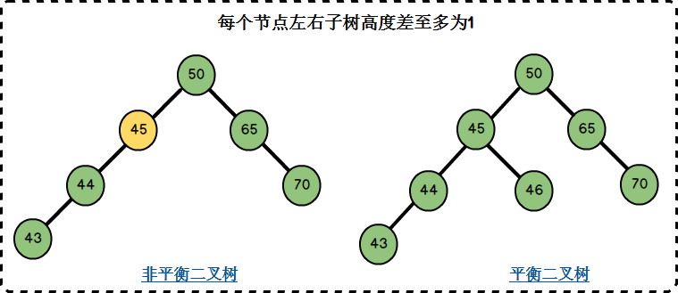

#  DataStructure-learning

To preserve some data structure I wrote.

# 知识点整理

[TOC]

# 第一章 绪论  

## 数据结构定义

- **数据结构** 是相互之间存在一种或多种特定关 系的数据元素的集合

- **数据元素** 是数据的基本单位

- **数据项** 是数据的不可分割的最小单位

## 数据逻辑结构的分类

**两空** 

- 线性结构

- 非线性结构

**三空** 

- 线性结构
- 树形结构
- 图状结构

**四空** 

- 集合
- 线性结构
- 树形结构
- 图状结构

## 两类物理存储方式及特点

## 时间复杂度（排序、分析算法）的计算

>频度：语句重复执行的次数

# 第二章 线性表 

## 线性表的定义

>n个数据元素的有限序列。

线性表：

```c++
typedef struct Sqlist {
    ElemType *e;    //存储基地址
    int length;    //表的使用长度
    int listSize;    //表分配的存储空间大小
} SqList；
```

分配地址：

```c++
e = (ElemType *)malloc(listSize*sizeof(ElemType));
```

单链表：

```c++
typedef struct LNode {
    ElemType e;
    struct Lnode *next;
} LNode, *LinkList;
```

## 非空循环单链表的特点

>无须增加存储量，仅对表的链接方式稍作改变，即可使得表处理更加方便灵活。

## 判断空表

链表为空，`head->next == NULL`

循环链表为空时，头结点`head->next == head`

## 是否访问到尾元素

链表到尾元素，`p->next == NULL`

循环链表到尾元素，`p->next == head`

## 顺序表中插入、删除操作移动元素的个数

在第i个元素之前插入一个元素时，需将第n至第i（**共n-i+1个**）元素向后移动一个位置。

删除第i个元素时需将第i+1至第n（**共n-i个**）元素依次向前移动一个位置。

## 单链表的插入与删除操作时间复杂度计算

插入或删除元素时，平均移动表中一半元素，则表长为n的插入删除时间复杂度为**O(n)**。

## 双向循环链表插入结点操作

```c++
// 若p指向插入位置的前一个元素
struct Node *newNode = (struct Node*)malloc(sizeof(struct Node));
newNode->pre = p;
newNode->next = p->next;
p->next->pre = newNode;
p->next = newNode;
```

## 合并有序链表

时间复杂度**O(Length_a + Length_b)**

# 第三章 栈和队列

## 栈和队列的逻辑特性

- 栈：先进后出
- 队列：先进先出

## 顺序栈的出栈、入栈

> 若base的值为NULL，则表明栈结构不存在。

## 栈的常见应用

- 数制转换
- 行编辑程序
- 迷宫求解
- 表达式求值

## 循环顺序队列出队和入队操作时队首队尾指针变化

除队列头元素算法中的特殊情况：当队列中最后一个元素被删后队列尾指针也丢失了，因此需对队尾指针重新赋值

```c
Q.rear = Q.front
```

## 循环顺序队列有关判断

- 判队空

```c
Q.front == Q.rear
```

- 判队满

```c
(Q.rear + 1) % MAXQSIZE == Q.front
```

- 求队中元素个数

```c
num = (rear - front + MAXQSIZE) % MAXQSIZE
```

## 指针操作

- 入队后指针操作

```c
Q.rear = (Q.rear + 1) % MAXQSIZE
```

- 出队后指针操作

```c
Q.front = (Q.front + 1) % MAXQSIZE
```

## 给出front、rear指针，操作求值

## 常考题型

5. 一个栈的进栈序列是**a**，**b**，**c**，**d**，**e**，则栈的不可能的输出序列是（  D  )

       **A.abcde           B.edcba**
        
       **C.decba           D.dceab**


# 第四章  串

## 串的定义

>由零个或多个字符组成的有限序列

>串中字符的数目n称为串的**长度**

## 空串和空格串的区别

>零个字符的串称为**空串**，它的长度为零

> 有一个或多个空格组成的串称为**空格串**，他的长度为串中空格字符的个数

## 了解串的模式识别算法

> KMP算法－－最长相等前后缀

# 第五章 数组和广义表

## 数组和广义表的定义

## 二维数组地址的计算

按行优先：

$$
LOC(i, j) = LOC(0, 0) + (b2 * i + j)L
$$

按列优先：

$$
LOC(i, j) = LOC(0, 0) + (b2 * j + i)L
$$


## 三角矩阵按列（行）优先存放地址的计算

- 对称矩阵

    	

    1. 以行序为主序存储下三角阵
        $$
        k=\begin{cases}
        i(i - 1) / 2 + j - 1 & i >= j \\
        j(j - 1) / 2 + i - 1 & i < j 
        \end{cases}
        $$
        

        
2. 以列序为主序存储上三角阵	
    
    |  a11  | a12  | a22  | a13  | a23  | ...... |   a1n    | ...... |    ann     |
        | :---: | :--: | :--: | :--: | :--: | :----: | :------: | :----: | :--------: |
        | k = 0 |  1   |  2   |  3   |  4   |        | n(n-1)/2 |        | n(n+1)/2-1 |
        
        
        $$
        k=\begin{cases}
        j(j - 1) / 2 + i - 1 & i <= j \\
        i(i - 1) / 2 + j - 1 & i > j 
        \end{cases}
        $$

## 广义表的定义及求表头、表尾操作

$$
LS = (a_1, a_2, ···, a_n)
$$

> $$a_i$$可以是单个元素，也可以是广义表，分别称为广义表LS的**原子**和**子表**

> 当广义表非空时，称第一个元素a1为LS的**表头**，称其余元素组成的表（a2, a3, ···, an）是LS的**表尾**


# 第六章 树和二叉树  

## 树和二叉树的定义

- 树的结点：包含一个数据元素及若干指向其子树的分支
- 结点的度：结点拥有的子树数（该结点孩子的个数）
- 叶子（终端结点）：度为0的结点
- 树的度：树内各结点的度的最大值
- 树的深度（高度）：树中结点的最大层次

> 如果将树中结点的各子树看成从左至右是有次序的（即不能互换），则称该树为**有序树**，否则称为**无序树**。

- 树：无序树

- 二叉树：有序树

```
Q：二叉树是树吗？
A：不是。
```

## 完全二叉树

> 如果深度为k、由n个结点的二叉树中各结点能够与深度为k的顺序编号的满二叉树从1到n标号的结点相对应，则称这样的二叉树为完全二叉树。

## 满二叉树

> 一棵深度为k且由2k-1个结点组成的二叉树称为满二叉树

除最后一层无任何子节点外，每一层上的所有结点都有两个子结点的二叉树。

## 二叉树的五个性质

1. 在二叉树的第i层上至多有$$ 2 ^{i - 1}$$个结点 （i>=1）

2. 深度为k的二叉树至多有$$2^k - 1$$个结点（k>=1)

3. 对任何一棵二叉树，如果其终端结点数为n0，度为2的结点数为n2，则$$n0 ＝ n2 + 1$$（理解证明过程）

   - 终端结点数n0

   - 度为1的节点数n1

   - 度为2的节点数n2

   - 总共结点数n
     $$
     n = n0 + n1 + n2\\
     
     n = n1 + 2*n2 + 1
     $$
     

4. 具有n个结点的完全二叉树的深度为$$\lfloor \log_2n \rfloor + 1$$（理解log怎么来的）

##  二叉树的先序、中序、后序遍历


## 普通树结点个数、度、和分支数的关系


## 树和二叉树、森林和二叉树

- 树转二叉树

  1. 加线：在兄弟之间加一连线
  2. 抹线：对每个结点，除了其左孩子外，去除其与其余孩子之间的关系
  3. 旋转：以树的根结点为轴心，将整树顺时针转45°
  
- 森林转二叉树
  
  1. 将各棵树分别转换成二叉树
  2. 将每棵树的根结点用线相连
  3. 以第一棵树根结点为二叉树的根，再以根结点为轴心，顺时针旋转，构成二叉树型结构
  
- 遍历方法的对应关系

  > 森林的先序和中序遍历即为其对应二叉树的先序和中序遍历

  > 树的先根和后根遍历即为其对应二叉树的先序和中序遍历

## 二叉链表存储线索二叉树的空指针个数

> 在有n个结点的二叉链表中必定存在n+1个空链表

## 线索二叉树中序遍历方法

> 非终端结点的的后继是其右子树中最左下结点

> 结点若左链为线索，指示其前驱；否则前驱为其左子树中最右下结点

1. 找到序列中的第一个节点
2. 依次找到节点后继直至其后继等于其头结点为止

## Huffman树的特点

- 没有度为1的结点（每个非叶子结点都是由两个最小值的结点构成）
- n个叶子结点的哈夫曼树总共有2n-1个结点
- 哈夫曼树的任意非叶结点的左右子树交换后仍是哈夫曼树
- 对同一组权值{w1，w2，..}，存在不同构的两个哈夫曼树，但是它们的总权值相等。

## 构造方法

1. 根据给定的n个权值 ，构造n棵只有一个根结点的二叉树， n个权值分别是这些二叉树根结点的权。设F是由这n棵二叉树构成的集合
2. 在F中选取两棵根结点树值最小的树作为左、右子树，构造一颗新的二叉树，置新二叉树根的权值等于左、右子树根结点权值之和
3. 从F中删除这两颗树，并将新树加入F
4. 重复 2、3，直到F中只含一颗树为止

## 求Huffman编码

> 左0右1构建

#   第七章 图    

##   图的定义

- 有向完备图——n个顶点的有向图最大边数是n(n-1)

- 无向完备图——n个顶点的无向图最大边数是n(n-1)/2

- 网——带权的图

- 路径长度——沿路径边的数目或沿路径各边权值之和

- 回路——第一个顶点和最后一个顶点相同的路径

- 简单路径——序列中顶点不重复出现的路径

- 简单回路——除了第一个顶点和最后一个顶点外，其余顶点不重复出现的回路

- 连通——从顶点V到顶点W有一条路径，则说V和W是连通的

- 连通图——图中任意两个顶点都是连通的

- **连通分量**——非连通图的每一个连通部分

- 强连通图——有向图中，如果对每一对Vi,Vj$$\in$$V, Vi!=Vj,从Vi到Vj和从Vj到Vi都存在路径，则称G是~

> 一个连通图的**生成树**是一个极小连通子图，它含有图中所有顶点，但只有足以构成一棵树的n-1条边。**如果在一棵生成树上添加一条边，则必定构成一个环；删去一条边，则不连通。**

## 结点度的计算

## 图的深度和广度优先遍历方法

## 图(或网)的存储（邻接表、邻接矩阵）


### 方法及特点

- 构建邻接表O(n+e)（n表示节点数，e表示边数）
- 初始化邻接矩阵O($$n^2$$)，构建无向网O($$n^2+e*n$$)

## 最小生成树的概念及求法

[最小生成树：https://blog.csdn.net/ZhuRanCheng/article/details/119791246](https://blog.csdn.net/ZhuRanCheng/article/details/119791246)

>图的所有生成树中具有边上的权值之和最小的树称为图的最小生成树

### Prim算法

- 关键：下一步应该在所有连通U中和V-U中的顶点的边中，选取权值最小的边
- 时间复杂度O($$n^2$$)
- **与网中边数无关，适用于求边稠密的网的最小生成树**

### Kruskal算法

- 从图G中选择权值最小的边，如果该边的两个顶点落在图T的**不同连通分量**上，则将该边加入到T中，否则（若产生回路）选择下一条边
- 时间复杂度O($$eloge$$)(e为网中边的数目)
- **适于求边稀疏的网的最小生成树**

## 拓扑排序

https://blog.csdn.net/lisonglisonglisong/article/details/45543451

> 拓扑排序（Topological Sorting）是一个有向无环图（DAG, Directed Acyclic Graph）的所有顶点的线性序列。

### AOV-网

> 用顶点表示活动，用弧表示活动间的优先关系的有向图称为顶点表示活动的网

该序列必须满足下面两个条件：

1. 每个顶点出现且只出现一次。
2. 若存在一条从顶点 A 到顶点 B 的路径，那么在序列中顶点 A 出现在顶点 B 的前面。

构建方法：

1. 从 DAG 图中选择一个没有前驱（即入度为0）的顶点并输出。

2. 从图中删除该顶点和所有以它为起点的有向边。

3. 重复 1 和 2 直到当前的 DAG 图为空或**当前图中不存在无前驱的顶点为止**。后一种情况说明有向图中必然存在环。

    

    ```c++
    bool TopologicalSort(ALGraph G) {
        FindInDegree(G, indegree);    //对各顶点求入度
        InitStack(S);
        for (int i = 0; i < G.vexnum; i++) {    //建零入度顶点栈
            if (!indegree[i]) Push(S, i);    //入度为零者进栈
        }
        int count = 0;
        while (!StackEmpty(S)) {
            Pop(s, i);    //输出i号顶点并计数
            printf(i, G.vertices[i].data);
            count++;
            for (p = G.vertices[i].firstarc; p; p = p->nextarc) {
                k = p->adjvex;    //i号顶点的每个邻接顶点入度减1
                if (!(--indegree[k])) Push(S, K);    //入度减为0则入栈
            }
        }
        if (count < G.vexnum) return false;    //该有向图有回路
        else return true;
    }
    ```


## 关键路径求法

### AOE-网

> 顶点表示事件，弧表示活动，权表示活动持续时间的，边表示活动的网

- “事件(顶点)” 的 最早发生时间 ve(j)

  1. Max{ve(i) + dut(<i, j>)}
  2. 最早：前序工程一旦都完成，马上开干
- “事件(顶点)” 的 最迟发生时间 vl(k)

  1. Min{vl(j) - dut(<i, j>)}
  2. 最迟：再不开干，会耽搁后续工程工期
- “活动(弧)” 的 最早开始时间 e(j)
    - e(i) = ve(j)

- “活动(弧)” 的 最迟开始时间 l(k)
    - l(i) = vl(k) - dut(<j, k>)

- 完成第i项活动的时间余量:  l(i)－ e(i) 

> “关键活动”必为：**l(i)－e(i) = 0**，即 e(i) = l(i) 的活动。

# 第九章 查找 

- 动态查找
- 静态查找
    - 顺序查找
    - 二分查找

## 顺序表查找的平均查找长度

$$ASL_{SS} = (n + 1) / 2$$

## 二分（折半）查找

- ### 过程

    1. 若k == r[mid].key，查找成功
    2. 若k < r[mid].key，则high = mid - 1；若k > r[mid].key，则low = mid + 1 
    3. mid = (low + high) / 2 
    4. 重复上述操作，直至low > high时，查找失败

- ### 查找失败时的比较次数

    $$\lfloor \log_2n \rfloor + 1$$

> 折半查找的效率比顺序查找高，但折半查找只适用于有序表，且限于顺序存储结构（对线性链表无法有效地进行折半查找）

## 动态查找和静态查找的概念

- **静态查找表(Static Search Table)——基于线性表的查找法**

    查询某个特定的元素是否在表中；检索某个特定的元素的各种属性。

    即：只作查找操作的查找表

- **动态查找表(Dynamic Search Table)——基于树表的查找法**

    在查找的同时对表做修改运算(如插入和删除)。

    即：在查找过程中同时插入查找表中不存在的数据元素，或删除某个已存在的数据元素。

## 二叉排序树的平均查找长度


查找成功的平均查找长度为： $$ ∑（本层高度*本层元素个数）/ 节点总数=（1*1+2*2+3*3+3*4）/9 $$


查找不成功的平均查找长度：$$∑（本层高度*本层补上的叶子个数）/补上的叶子总数=（2*1+3*3+4*6）/10$$

## 平衡二叉树的定义及构造

>它或者是一颗空树，或者具有以下性质的[二叉排序树](https://so.csdn.net/so/search?from=pc_blog_highlight&q=二叉排序树)：它的左子树和右子树的深度之差(平衡因子)的绝对值不超过1，且它的左子树和右子树都是一颗平衡[二叉树](https://so.csdn.net/so/search?from=pc_blog_highlight&q=二叉树)。




> **平衡因子**：将[二叉树](https://so.csdn.net/so/search?from=pc_blog_highlight&q=二叉树)上节点的左子树高度减去右子树高度的值称为该节点的平衡因子BF(Balance Factor)。


## 哈希表的构造

>哈希表通过把关键码值映射到表中一个位置来访问记录，以加快查找的速度。

- 除留余数法：取关键字被某个不大于散列表表长m的数p除后所得的余数为散列地址。即 H(key) = key MOD p,p<=m。

## 处理冲突的方法

- 线性探测再散列法
    - $$d_i = 1, 2, 3, ... , m - 1$$
    - 冲突发生时，顺序查看表中下一单元，直到找出一个空单元或查遍全表。

- 二次探测再散列法
    - $$d_i = 1^2, -1^2, 2^2, -2^2, ... , k^2, -k^2 (k <= m / 2)$$
    - 冲突发生时，在表的左右进行跳跃式探测，比较灵活。

## 平均查找长度

将关键字序列{7, 8, 30, 11, 18, 9, 14}散列存储到散列表中。散列表的存储空间是一个下标从0开始的一维数组，长度为10，即{0, 1, 2, 3, 4, 5, 6, 7, 8, 9}。散列函数为： H(key) = (key * 3) % 7，处理冲突采用线性探测再散列法。
求等概率情况下查找成功和查找不成功的平均查找长度。

```
H(7) = (7 * 3) % 7 = 0
H(8) = (8 * 3) % 7 = 3
H(30) = 6
H(11) = 5
H(18) = 5
H(9) = 6
H(14) = 0
```

按关键字序列顺序依次向哈希表中填入，发生冲突后按照“线性探测”探测到第一个空位置填入。
H(7) = 0，key = 7应插在第0个位置，因为第0个位置为空，可以直接插入。
H(8) = 3，key = 8应插在第3个位置，因为第3个位置为空，可以直接插入。
H(30) = 6，key = 30应插在第6个位置，因为第6个位置为空，可以直接插入。
H(11) = 5，key = 11应插在第5个位置，因为第5个位置为空，可以直接插入。
H(18) = 5，key = 18应插在第5个位置，但是第5个位置已经被key=11占据了，所以往后挪一位到第6个位置，但是第6个位置被key=30占据了，再往后挪一位到第7个位置，这个位置是空的，所以key=18就插到这个位置
H(9) = 6，key = 9应插在第6个位置，但是第6个位置已经被key = 30占据，所以需要往后挪一位到第7个位置，但是第7个位置已经被key = 18占据，所以再往后挪移到第8个位置，这个位置是空的，所以key = 9就插到这个位置。
H(14) = 0，key = 14应插在第0个位置，但第0个位置已被key=7占据，所以往后挪移一位到第1个位置，这个位置是空的，所以key=14就插到这个位置。

最终的插入结果如下表所示：

| 地址 | 0    | 1    | 2    | 3    | 4    | 5    | 6    | 7    | 8    | 9    |
| :--: | ---- | ---- | ---- | ---- | ---- | ---- | ---- | ---- | ---- | ---- |
| key  | 7    | 14   |      | 8    |      | 11   | 30   | 18   | 9    |      |

查找7，H(7) = 0，在0的位置，一下子就找到了7，查找长度为1。
查找8，H(8) = 3，在3的位置，一下子就找到了8，查找长度为1。
查找30，H(30) = 6，在6的位置，一下子就找到了30，查找长度为1。
查找11，H(11) = 5，在5的位置，一下子就找到了11，查找长度为1。
查找18，H(18) = 5，第一次在5的位置没有找到18，第二次往后挪移一位到6的位置，仍没有找到，第三次再往后挪移一位到7的位置，找到了，查找长度为3。
查找9，H(9) = 6，第一次在6的位置没找到9，第二次往后挪移一位到7的位置，仍没有找到，第三次再往后挪移一位到8的位置，找到了，查找长度为3.
查找14，H(14) = 0，第一次在0的位置没找到14，第二次往后挪移一位到1的位置，找到了，查找长度为2。

所以，**查找成功**的平均查找长度为(1 + 1 + 1 + 1 + 3 + 3 + 2) / 7 = 12 / 7

# 第十章 排序  

## 排序的分类

- 内部排序
    - 插入排序
    - 选择排序
    - 交换排序
    - 归并排序
- 外部排序

## 直接插入排序

1. 核心思想：插入排序通过构建有序序列，对于未排序数据，在已排序序列中从后向前扫描，找到相应位置并插入 ，如此重复，直至完成序列排序。

2. 算法分析：
    1. 从序列第一个元素开始，该元素可以认为已经被排序
    2. 取出下一个元素，设为待插入元素，在已经排序的元素序列中从后向前扫描，如果该元素（已排序）大于待插入元素，将该元素移到下一位置。
    3. 重复步骤2，直到找到已排序的元素小于或者等于待排序元素的位置，插入元素
    4. 重复2，3步骤，完成排序。
    
    
    
    ```c++
    // 直接插入排序(C++)
    void InsertSort(vector<int> &vi) {
        for (int i=1;i<vi.size();i++) {
            int temp=vi[i];
            int j;
            for (j=i-1;j>=0&&temp<vi[j];j--) {
                vi[j+1]=vi[j]；     //将较大元素后移
            }
            vi[j+1]=temp;        //temp插入正确的位置
        }
    }
    ```

3. 性能分析
    1. 时间复杂度：
        1. 顺序排列时，只需比较(n-1)次，插入排序时间复杂度为O(n)；
        2. 逆序排序时，需比较n(n-1)/2次，插入排序时间复杂度为O($n^2$)；
        3. 当原始序列杂乱无序时，平均时间复杂度为O($n^2$)。
    2. 空间复杂度：
        - 插入排序过程中，需要一个临时变量temp存储待排序元素，因此空间复杂度为O(1)。
    3. 算法稳定性：
        - 插入排序是一种稳定的排序算法。

## 二分插入排序

> 排序的原理：是直接插入排序的一个变种；区别是：在有序区中查找新元素插入位置时，为了减少元素比较次数提高效率，采用二分查找算法进行插入位置的确定。

设数组为a[0…n]。

1. 将原序列分成有序区和无序区。a[0…i-1]为有序区，a[i…n] 为无序区。（i从1开始）
2. 从无序区中取出第一个元素，即a[i]，使用二分查找算法在有序区中查找要插入的位置索引j。
3. 将a[j]到a[i-1]的元素后移，并将a[i]赋值给a[j]。
4. 重复步骤2~3，直到无序区元素为0。

```c++
// 二分插入排序
void BinInsertSort(vector<int> &vi) {
    for(int i=1;i<vi.size();i++) {
        int left=0;
        int right=i-1;
        int temp=vi[i]
        while(left<=right) {
            int mid=(left+right)/2; //二分区域
            if(vi[mid]>temp) {
                right=mid-1;       //向左缩小区域
            } else {
                left=mid+1;        //向右缩小区域
            }
        }
        for(int j=i-1;j>left;j--) {  //vi[left,i-1]的元素整体后移
            vi[j+1]=vi[j];
        }
        vi[left]=temp;
    }
}
```

## 希尔排序

> 通过增量(gap)将元素两两分组，对每组使用直接插入排序算法排序；增量(gap)逐渐减少，当增量(gap)减至1时，整个数据恰被分成一组，最后进行一次插入排序，整个数组就有序了。

数组由{7, 3, 1, 9, 5, 4, 2, 8, 6} 这9个无序元素组成。

第一次:gap = 9/2 = 4 ，每个元素和后面的元素之间间隔4，元素被分成4组。其中元素7, 5, 6分成一组，元素3,4分成一组，元素1, 2分成一组，元素9,8分成一组；动画：


第二次:gap = 4/2 = 2，每个元素和后面的元素之间间隔2，元素被分成2组。 动画：


第三次:gap = 2/2 = 1 ，每个元素和后面的元素之间间隔1，元素被分成1组。动画：


## 冒泡排序

> 比较相邻记录，将关键字最大的记录交换到 n-i+1 的位置上
>
> 起泡排序的结束条件为,最后一趟没有进行“交换记录”。


## 快速排序的排序过程

- 1．先从数列中取出一个数作为基准数。
- 2．分区过程，将比这个数大的数全放到它的右边，小于或等于它的数全放到它的左边。
- 3．再对左右区间重复第二步，直到各区间只有一个数。  

## 堆排序

- 大顶堆：每个节点的值都大于或者等于它的左右子节点的值。

- 小顶堆：每个节点的值都小于或者等于它的左右子节点的值。

    

1. 将带排序的序列构造成一个大顶堆，根据大顶堆的性质，当前堆的根节点（堆顶)就是序列中最大的元素；
2. 将堆顶元素和最后一个元素交换，然后将剩下的节点重新构造成一个大顶堆；
3. 重复步骤2，如此反复，从第一次构建大顶堆开始，每一次构建，我们都能获得一个序列的最大值，然后把它放到大顶堆的尾部。最后，就得到一个有序的序列了。

复杂度分析：

因为堆排序无关乎初始序列是否已经排序已经排序的状态，始终有两部分过程，构建初始的大顶堆的过程时间复杂度为O(n)，交换及重建大顶堆的过程中，需要交换n-1次，重建大顶堆的过程根据完全二叉树的性质，[$$log_2(n-1),log_2(n-2)...1$$]逐步递减，近似为nlogn。所以它最好和最坏的情况时间复杂度都是O(nlogn)，空间复杂度O(1)。

## 简单选择排序、堆排序的适用情况

1. 大量的N个数据中找最大/最小的k个元素时，用堆排序是比较快的


## 各类排序算法的稳定性及时间和空间复杂度

- 时间性能
    - O(nlogn)
        - 快速排序
        - 堆排序
        - 归并排序
    - O($$n^2$$)
        - 直接插入排序
        - 起泡排序
        - 简单选择排序
    - O(d(n+rd))
        - 基数排序
    - 当待排记录序列按关键字顺序有序时
    - 直接插入排序和起泡排序能达到O(n)的时间复杂度;  快速排序的时间性能蜕化为O(n2) 
    - 简单选择排序、堆排序和归并排序的时间性能不随记录序列中关键字的分布而改变。
- 空间性能
    - 所有的简单排序方法(包括：直接插入、起泡和简单选择) 和堆排序的空间复杂度为O(1)；
    - 快速排序为O(logn)，为递归程序执行过程中，栈所需的辅助空间;
    - 归并排序所需辅助空间最多，其空间复杂度为 O(n);  
    - 链式基数排序需附设队列首尾指针，则空间复杂度为 O(rd)。（rd为“基” 的取值范围）
    
- 稳定性
    - 快速排序、堆排序和希尔排序是不稳定的排序方法。
    - 一般来说，采用相邻比较的排序方法都是稳定的排序方法。


# 重点算法

## 二分查找

## 二叉树中序非递归遍历

## 有序单链表合并

## 拓扑排序